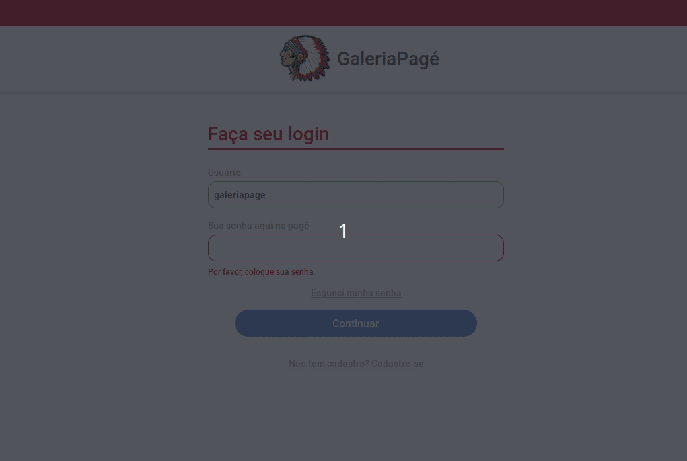

# Galeria Pagé - Teste Front-End
## Resumo
Este projeto é um teste para a vaga de front-end da Galeria Pagé.

## Tecnologias Utilizadas
- React
- Redux
- Redux Saga
- React Hooks
- React Router V5
- JSS (css-in-js)
- Jest
- Storybook
- Docker

## Instruções
### Executando o projeto
> docker-compose up

### Rodando os testes
> yarn install && yarn jest

### Storybook
> yarn install && yarn storybook
